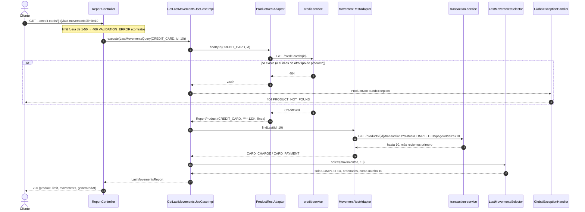

# Secuencia — Últimos movimientos de una tarjeta (`GET /reports/products/credit-cards/{id}/last-movements`)

Implementado en `GetLastMovementsUseCaseImpl` (R3), `ProductRestAdapter` / `MovementRestAdapter` (R7)
y `LastMovementsSelector` (R2). Sirve igual para cuentas y créditos.

## Notas

- **Una sola consulta de movimientos:** `size=N` en la primera página ya trae los N más recientes
  (transaction-service ordena más reciente primero). `LastMovementsSelector` vuelve a ordenar y
  cortar, para que el resultado no dependa de ese detalle de la fuente.
- **Movimientos de tarjeta de crédito** = consumos (`CARD_CHARGE`) y pagos (`CARD_PAYMENT`), que
  credit-service registra en el historial de transaction-service (regla 8).
- **El tipo de la ruta decide a quién se pregunta:** un id de cuenta pedido como `credit-cards` se
  busca en credit-service y da 404.
- **Tarjeta de débito:** `debit-cards` → 501 `NOT_AVAILABLE` hasta P3 (lo decide el adaptador REST,
  no el caso de uso).
