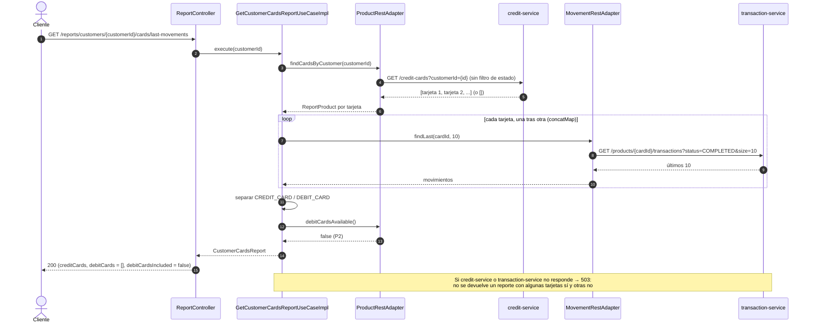

# Secuencia — Tarjetas de un cliente (`GET /reports/customers/{customerId}/cards/last-movements`)

Implementado en `GetCustomerCardsReportUseCaseImpl` (R3) y `ProductRestAdapter` /
`MovementRestAdapter` (R7). En P2 solo hay tarjetas de crédito.

## Notas

- **Sin 404 por cliente.** report-service no conoce clientes: uno sin tarjetas (o inexistente)
  recibe listas vacías.
- **Cualquier estado.** Se listan también las tarjetas `OVERDUE` y `CLOSED`, cada una con sus últimos
  movimientos.
- **`concatMap`, no `flatMap`:** conserva el orden en que credit-service devuelve las tarjetas y evita
  lanzar N llamadas simultáneas a transaction-service.
- **P3:** las tarjetas de débito vienen del read model (`debitCardsIncluded = true`) y sus
  movimientos son los pagos de `debit-service`.
