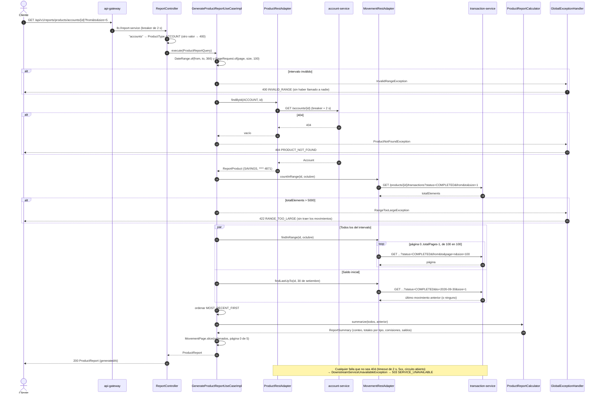

# Secuencia — Reporte completo de un producto en P2 (`GET /reports/products/{type}/{id}`)

Implementado en `ReportController` / `ReportRestMapper` (R5), `GenerateProductReportUseCaseImpl` (R3),
`ProductRestAdapter` y `MovementRestAdapter` sobre `RestSource` (R7) y `ProductReportCalculator` (R2).
Ejemplo: el ahorro de A en octubre, `?from=2026-10-01&to=2026-10-31&size=5`.

## Notas

- **Sin base de datos en P2.** Todo se consulta a los servicios dueños y se calcula en memoria; el
  costo de recorrer páginas por REST es aceptable con datos de demo (ficha §12). En P3 los dos
  adaptadores se reemplazan por consultas al read model y el caso de uso no cambia.
- **El tope se comprueba antes de traer.** Una página de tamaño 1 basta para saber `totalElements`;
  así un intervalo enorme se rechaza con dos llamadas, no con cincuenta.
- **El resumen y la página salen de la misma lista.** El resumen necesita todos los movimientos del
  intervalo (regla 4), así que la página se corta en memoria (`MovementPage.slice`) en vez de pedirla
  aparte a transaction-service.
- **Solo `COMPLETED`.** transaction-service filtra con `status=COMPLETED` (quedan fuera los
  `FAILED`, `PENDING`, `DISCARDED` y `REVERSED`, también la comisión de una pata compensada) y el
  calculador vuelve a filtrar por si acaso.
- **Saldo inicial.** Es el `resultingBalance` del último movimiento hasta el día anterior a `from`;
  la apertura de una cuenta no es un movimiento, así que una cuenta sin movimientos previos no tiene
  saldo inicial.
- **Créditos y tarjetas.** El mismo flujo con `credits` / `credit-cards`: la cabecera viene de
  credit-service y el saldo resultante es el saldo pendiente o el monto usado. `debit-cards` → 501
  hasta P3.
