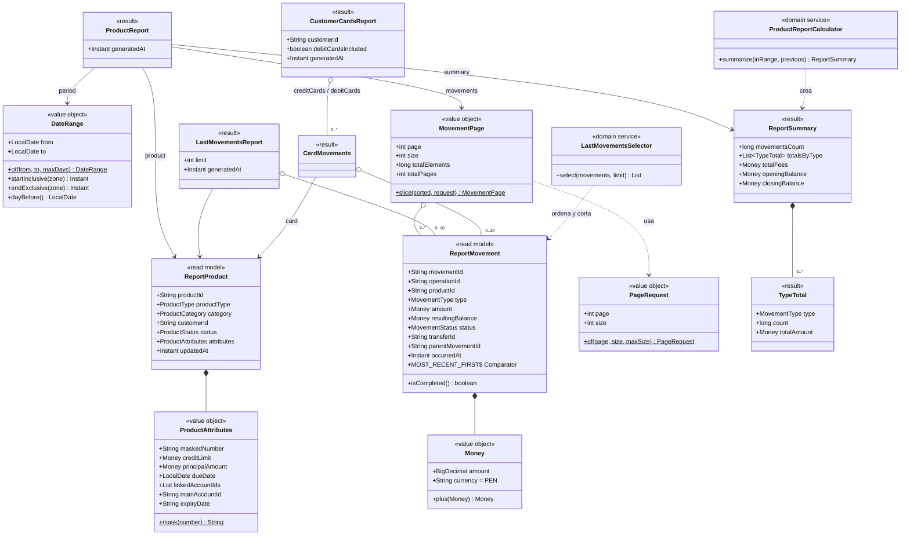

# UML — Dominio de report-service

Paquete `com.bank.report.domain` (R2). Servicio de **solo lectura**: no hay aggregates con
comportamiento de negocio. El dominio es un modelo de lectura inmutable y dos **cálculos puros**
con Streams. En P2 el modelo se arma en cada consulta a partir de account-, credit- y
transaction-service; en P3 vendrá de un read model en Mongo, sin cambiar este paquete.

## Modelo de lectura y resultados

## Enums

| Enum | Valores |
|---|---|
| `ProductType` | `ACCOUNT`, `CREDIT`, `CREDIT_CARD`, `DEBIT_CARD` (en la ruta: `accounts`, `credits`, `credit-cards`, `debit-cards`) |
| `ProductCategory` | `SAVINGS`, `CHECKING`, `FIXED_TERM`, `PERSONAL_CREDIT`, `BUSINESS_CREDIT`, `CREDIT_CARD`, `DEBIT_CARD` |
| `ProductStatus` | `ACTIVE`, `INACTIVE`, `OVERDUE`, `PAID`, `CLOSED` |
| `MovementType` | Los 11 de transaction-service |
| `MovementStatus` | `COMPLETED`, `REVERSED` |

## Reglas y dónde se aplican

| Regla | Dónde |
|---|---|
| Intervalo obligatorio, `from ≤ to`, máximo 366 días (contando ambos extremos) → 400 `INVALID_RANGE` | `DateRange.of` |
| Página 0..n, tamaño 1–100 (por defecto 20) | `PageRequest.of` |
| Solo movimientos `COMPLETED`; los revertidos no cuentan | `ProductReportCalculator`, `LastMovementsSelector` (y la fuente filtra `status=COMPLETED`) |
| Más reciente primero; empate por `movementId` descendente | `ReportMovement.MOST_RECENT_FIRST` |
| El resumen cubre todo el intervalo, no solo la página | `GenerateProductReportUseCaseImpl` + `MovementPage.slice` |
| Saldo inicial = último movimiento antes del intervalo; final = el más reciente del intervalo | `ProductReportCalculator` |
| Totales por tipo en orden alfabético del tipo (como el ejemplo del contrato) | `ProductReportCalculator` |
| Más de `report.max-movements` (5000) → 422 `RANGE_TOO_LARGE`, sin traerlos | `GenerateProductReportUseCaseImpl` |
| Últimos N: 10 por defecto, 1–50 | `GetLastMovementsUseCaseImpl` |
